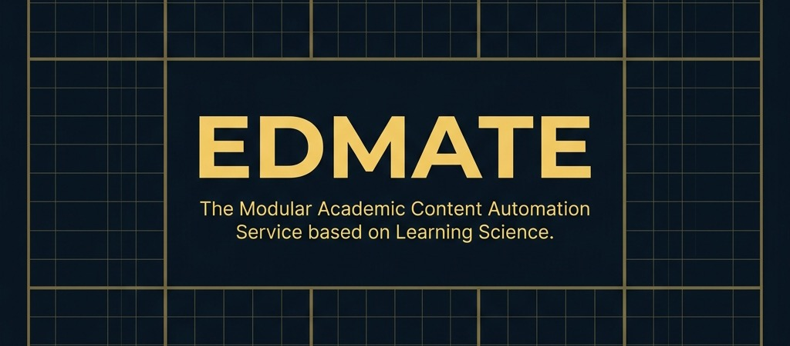
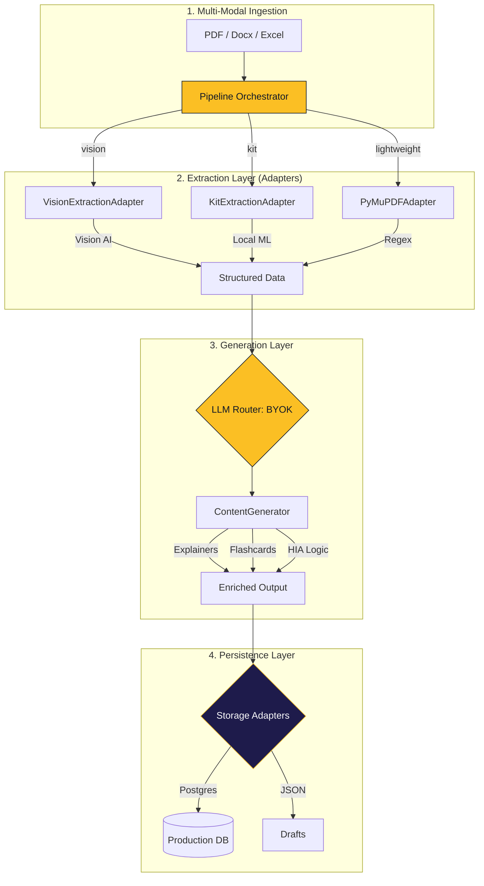

<p align="center">
  
</p>

<p align="center">
  <b>The Modular Automation Engine for Academic Assessments, Powered by Learning Science.</b>
</p>

<p align="center">
  
  
  
  
  
</p>

---

Edmate Lab_QA is a **headless, open-source service platform** designed to transform unstructured educational materials (**PDF, Excel, Docx**) into high-fidelity, curriculum-aligned **Q&A, explanations, and 3D flashcards**.

Built on a "Plug & Play" architecture, it empowers teachers, publishers, and developers to serve external platforms using their own AI logic and API keys.

---

## 🔍 Project Scope & Boundaries

Edmate is a **Content Factory Infrastructure**. Its mission ends where the learner's experience begins.

- **✅ IN-SCOPE**: Source ingestion, AI generation (Q&A/Explanations), human-in-the-loop review, and DB/File persistence.
- **❌ OUT-OF-SCOPE**: Learner test-taking UI, live grading, student progress tracking, or proctoring.

---

## ✨ Key Features

- 🛡️ **Economic Kill-Switch**: Real-time token tracking with automatic pipeline halts when daily USD budgets are reached.
- 🧩 **Intelligence-Blind & BYOK**: LLM-agnostic routing via LiteLLM. Support for 100+ providers. External platforms can **Bring Your Own Key (BYOK)** to dictate their own model selection and billing.
- 💾 **Adapter-Driven Persistence**: Swap between Postgres, Vector DBs, or JSON exports with zero changes to core logic.
- ⚡ **MCP Ready**: Plug Edmate directly into Agentic IDEs (Cursor/Windsurf) as a native tool for instant content generation.
- 📊 **Automation Hub**: A sleek, dark-mode dashboard for managing drafts, review workflows, and cost analytics.
- 🛡️ **High-Integrity (HIA) First**: Specialized engine for generating AI-resilient assessments (AI Critique, Isomorphic Variants, Viva Prompts) that combat AI cheating.

---

## 🚀 30-Second Quick Start

Get Edmate running locally in seconds.

```bash
# 1. Clone & Install
git clone https://github.com/shmukit/Edmate.git
cd Edmate
pip install -r content_gen/requirements.txt

# 2. Configure (Set your keys)
cp content_gen/.env.example content_gen/.env
```

### ⚠️ Note on PDFs and Git
> By default, large PDF files are ignored by git (`.gitignore` excludes `*.pdf` except for `sample.pdf`) to prevent repository bloat. Please keep your heavy exam papers local to your machine!

---

## 🛠️ Customizing Your Workspace

Edmate is designed to be highly adaptable. Before processing your first PDF, you must define your own subjects, curriculums, and database tables in `edmate_config.yaml` or `edmate_config.json`.

### 1. Connect Your Database (Agnostic)
Edmate is **database-agnostic**. While it includes a production-ready **Postgres/Supabase** adapter by default, you can use any database (MySQL, MongoDB, Firebase, etc.).

- **Using Postgres/Supabase?** Simply set your `DATABASE_URL` in `content_gen/.env`.
- **Using a different database?** Edmate uses the **Adapter Pattern**. You can swap the persistence layer by implementing a new Storage Adapter in `content_gen/adapters/`.

### 2. Define Your Schema
Navigate to the `workspace` section in `edmate_config.yaml` or `edmate_config.json` to tell Edmate which tables exist in *your* database:

```yaml
workspace:
  curriculums:
    - "Your Custom Curriculum"
    - "Standard Level"
  
  target_tables:
    - id: "questions"           # Must match your actual DB table name
      label: "Main Hub"         # How it appears in the UI
    - id: "biology_vault"       # Add as many as you need
      label: "Biology Bank"
```

> [!CAUTION]
> **Database Schema Consistency**: Edmate's `database_service.py` currently expects tables to have specific columns (e.g., `title`, `options`, `correct_options`). If your database uses different column names, you must update the SQL queries in `content_gen/scripts/processing/database_service.py` to match your schema.

### 3. Understanding Pipeline Settings
The **Automation Hub** provides several "Admin" settings to handle diverse document formats:
- **Extraction Guardrails**: Adjust "Detection Mode" to **Strict** for standard papers or **Open** for noisy documents.
- **Model Routing**: Strategies to balance cost and quality. Edmate can use cheaper models (like Gemini Flash) for extraction and switch to high-precision models (like GPT-4o) for final content generation.
- **Pedagogy Profiles**: Choose profiles like `exam_prep` or `beginner` to change how the AI writes explanations and scaffolds content.

---

### Option A: Use the Visual Automation Hub (UI)
Start the FastAPI backend to access the drag-and-drop dashboard:
```bash
uvicorn qc_viewer.main:app --host 0.0.0.0 --port 8000
```
Navigate to `http://localhost:8000/automate` in your browser.

### Option B: Use the CLI Orchestrator (Headless)
Process a PDF headlessly via terminal:
```bash
python3 content_gen/scripts/pipeline/pipeline_orchestrator.py --single-pdf path/to/your_paper.pdf
```

---

## 🔌 API Integration & BYOK

If you are a developer looking to integrate Edmate directly into your own platform using our **Bring Your Own Key (BYOK)** architecture, you can interact with the API directly.

1. **Start the API Server**: `uvicorn qc_viewer.main:app --host 0.0.0.0 --port 8000`
2. **Interactive API Docs**: Navigate to `http://localhost:8000/docs` to view the auto-generated Swagger UI which interactively documents all available endpoints.
3. **Python Example**: Check out the fully runnable Python example at [`examples/client_request.py`](examples/client_request.py). It demonstrates how to hit the `/api/v1/extract` endpoint, pass a provider-agnostic BYOK key via HTTP headers, and poll the job status until completion.

---

## 🔐 Partner BYOK Integration (Platform UI)

If a partner platform wants end-users to provide their own API key in the platform UI, use this pattern:

1. User enters key in partner UI.
2. Partner backend stores key securely (encrypted at rest / secret manager).
3. Partner backend sends requests to Edmate with `X-API-Key`.
4. Edmate processes the file and returns job status/results.

### Supported API key headers

- Preferred: `X-API-Key`
- Backward-compatible: `X-Gemini-Key`, `X-OpenAI-Key`

### Settings to expose in partner UI

- Minimum (required for secure BYOK operation):
  - API key input mapped to `X-API-Key`
- Recommended (materially changes output quality/behavior):
  - `curriculum`
  - `ls_profile`
  - `hia_mode`
  - `question_detection_mode`
  - `min_question_number`
  - `max_question_number`
- Optional advanced:
  - `X-LLM-Provider` (provider-family preference)
  - `X-Model-ID` (exact model pinning)
- Not recommended to expose yet (currently preview-only in local UI):
  - `target_language`
  - `routing_profile`

### Integration modes

- **Direct server-to-server (recommended):** Partner backend calls Edmate and injects `X-API-Key` per request.
- **Manual API call (no partner UI):** Integrator sends multipart form + `X-API-Key` directly from their backend/script.

### Minimal request example

```bash
curl -X POST "http://localhost:8000/api/v1/extract" \
  -H "X-API-Key: $LITELLM_API_KEY" \
  -F "file=@/path/to/paper.pdf" \
  -F "curriculum=Cambridge O/Level" \
  -F "subject=Biology"
```

### Partner request with recommended settings

```bash
curl -X POST "http://localhost:8000/api/automate/draft" \
  -H "X-API-Key: $LITELLM_API_KEY" \
  -H "X-LLM-Provider: openai" \
  -H "X-Model-ID: gpt-4o-mini" \
  -F "file=@/path/to/paper.pdf" \
  -F "subject=Biology" \
  -F "paper_code=questions" \
  -F "curriculum=Cambridge O/Level" \
  -F "ls_profile=exam_prep" \
  -F "hia_mode=High" \
  -F "question_detection_mode=balanced" \
  -F "min_question_number=1" \
  -F "max_question_number=120"
```

### Security checklist

- Keep API keys on the server side (do not expose raw keys in browser logs or frontend bundles).
- Mask key input in UI and never return full keys in API responses.
- Avoid persisting keys in plain text; use encryption/secret vault where possible.
- Do not write keys to app logs, job metadata, or analytics events.
- **CORS & BYOK**: When calling Edmate from a different origin (e.g., your own dashboard), ensure your backend allows the custom headers (`X-API-Key`, etc.). Edmate's default configuration is permissive for local development but must be restricted in production.

---

## 🛠️ Troubleshooting CORS & Preflights

If you are integrating Edmate into a custom frontend (like a React or Vite app) and see **CORS errors** in your browser console:

### 1. The "Wildcard + Credentials" Trap
Browsers block `Access-Control-Allow-Origin: *` if the request includes credentials (cookies/auth) or certain custom headers. Edmate handles this by **reflecting the requesting origin** automatically.

### 2. Preflight (OPTIONS) Failures
If you send custom headers like `X-Gemini-Key`, the browser will send an `OPTIONS` request first.
- **Problem**: In many frameworks, if the CORS middleware is registered *after* the routes, the router will return a `405 Method Not Allowed` for the `OPTIONS` request, causing a CORS error.
- **Solution**: Edmate's `app_factory.py` ensures CORS middleware is at the top of the stack. If you modify the codebase, **never move the CORS middleware below the routers**.

### 3. Required Headers
Ensure your client-side fetch/axios configuration explicitly allows these headers if your environment is restrictive:
`X-API-Key`, `X-LLM-Provider`, `X-Model-ID`, `X-Gemini-Key`, `X-OpenAI-Key`.

---

## 🏗️ Modular Architecture

Edmate is built for extreme extensibility. It uses the **Adapter Pattern** to remain decoupled across all layers of the platform, from data ingestion to database schemas.



### 🧩 Dimensions of Modularity
1. **Multi-Modal Ingestion (Input):** Accepts Unstructured PDFs, Docx, and Excel/CSV files.
2. **Pluggable Extraction Engines:**
    - **Vision (High-Fidelity):** Multimodal LLMs "see" the page to capture complex layouts and diagrams.
    - **Kit (Local ML):** Uses YOLO-based layout detection for local, GPU-accelerated extraction.
    - **Lightweight:** Regex-based extraction for fast, CPU-only processing.
3. **Pedagogical Engine:** Applies Learning Science techniques (like our HIA engine) dynamically during the generation stage.
4. **Curriculum Agnostic:** Plug and play your specific curriculum format (e.g., GCSE A/O level, or any National Curriculum).
5. **Model Router (BYOK):** Bring Your Own Key. Route tasks to any LLM supported by your configured provider/router.
6. **Multi-Tier Output Generation:** Extracts simple raw content (Q/A, Diagrams, Tables as-is) alongside enriched metadata (rationales for right/wrong answers, concept gaps, and 3D flashcards).

---

## 📂 Repository Architecture

### 🏗️ Root Directory
| Path | Description |
| :--- | :--- |
| `content_gen/` | **The Brain**: Core AI pipeline for ingestion, extraction, and content generation. |
| `qc_viewer/` | **The Heart**: FastAPI backend and Automation Hub dashboard for review. |
| `docs/` | Comprehensive documentation on system design, pedagogy, and brand. |
| `examples/` | Client integration examples (BYOK usage, API polling). |
| `credentials/` | Secure storage for optional cloud credentials (when needed). |
| `edmate_config.yaml` / `.json` | Global project configuration (models, budgets, engines). |

### 🧠 Content Generation (`content_gen/`)
| Path | Description |
| :--- | :--- |
| `adapters/` | Pluggable connectors for storage (Postgres, JSON) and extraction. |
| `core/` | Internal logic: LLM routing, daily budgeting, and data schemas. |
| `data/` | Pipeline workspace: `inputs/`, `extracted/` text, and `outputs/`. |
| `scripts/` | CLI entry points for orchestrating the full pipeline. |
| `tools/` | Utility toolbox for PDF manipulation and image handling. |
| `tests/` | Unit and integration tests for the generation engine. |

### 📊 Automation Hub (`qc_viewer/`)
| Path | Description |
| :--- | :--- |
| `static/` | Frontend assets (Vanilla HTML/JS/CSS) for the dashboard. |
| `drafts/` | Persistence for human-in-the-loop content review tasks. |
| `jobs/` | Real-time tracking for asynchronous background generation tasks. |
| `main.py` | Entry point for the FastAPI server. |

---

## 🏛️ Edmate "Open Core" Model

Edmate is committed to keeping its core engine free and open-source forever. We follow an **Open Core** model where the essential tools are free, while advanced institutional features are part of our Studio/Enterprise offerings.

| Feature | Community (Free) | Studio / Enterprise |
| :--- | :---: | :---: |
| **Core AI Pipeline** | ✅ | ✅ |
| **PDF/Excel Ingestion** | ✅ | ✅ |
| **Standard Assessment (MCQ/TF)** | ✅ | ✅ |
| **High-Integrity Assessments (HIA)** | ✅ (Basic) | ✅ (Advanced) |
| **Custom Prompts** | ✅ | ✅ |
| **Collaboration & Teams** | ❌ | ✅ |
| **Advanced Institutional Analytics** | ❌ | ✅ |
| **Managed Cloud Hosting** | ❌ | ✅ |
| **SSO & RBAC** | ❌ | ✅ |

---

## 🛡️ Why High-Integrity Assessments (HIA)?

In the era of Generative AI, traditional "recall-based" homework is becoming obsolete. Edmate's mission is to help teachers and platforms move toward **Authentic Assessment** — content designed to ensure students "lift the weights" of their own education.

Edmate's HIA engine generates:
*   **AI Critique Exercises**: Students must find errors in deliberately flawed AI answers.
*   **Isomorphic Variants**: Unique numerical/contextual versions of the same concept per student.
*   **Viva Defense Prompts**: Structured probing questions for verbal reasoning verification.
*   **Scaffolded Sequences**: Breaking single tasks into mandatory intellectual process steps.

---

---

## 🤝 Community & Contributing

We welcome contributions of all kinds! Whether it's a new Storage Adapter, an extraction prompt, or a bug fix.

- 🗺️ **[Product Roadmap](ROADMAP.md)**: Where we're going and how to help get there.
- 🎯 **[Use Cases](docs/product/USE_CASES.md)**: How different users (Platforms vs. Teachers) adopt Edmate.
- 📖 **[Contributing Guide](CONTRIBUTING.md)**: How to get started.
- 📜 **[Code of Conduct](CODE_OF_CONDUCT.md)**: Our community standards.
- 🏗️ **[Modular Architecture Guide](docs/contributing/CONTRIBUTING_MODULAR.md)**: Deep dive for developers.
- 🧠 **[Pedagogy & Learning Science](docs/pedagogy/PEDAGOGY.md)**: The "How It Works" behind our content generation.

---

## 📄 License
Licensed under the MIT License. See `LICENSE`.

**Built with ❤️ for an accessible, AI-powered education system.**
