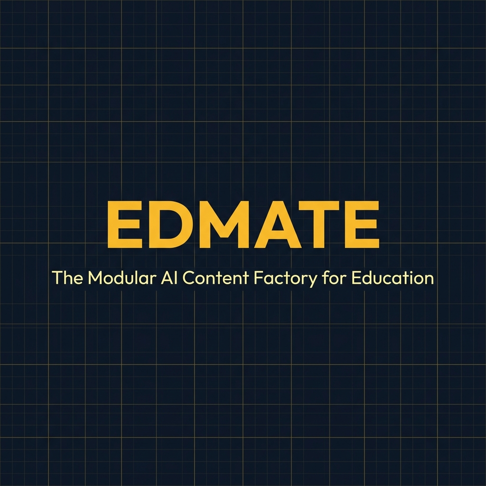
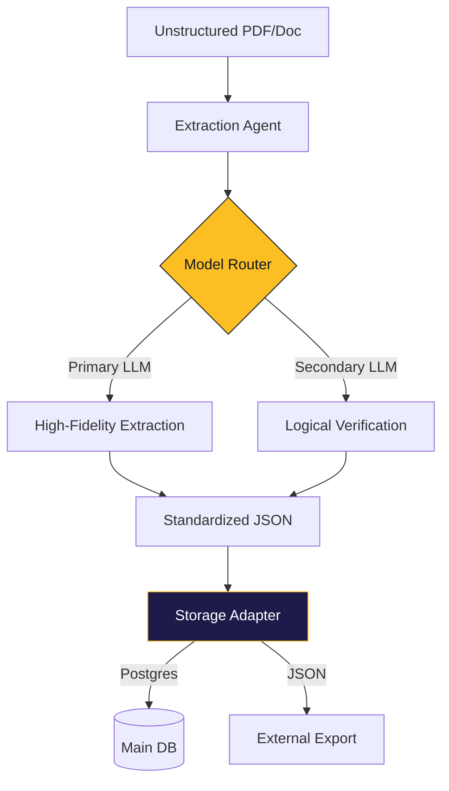

<p align="center">
  
</p>

<p align="center">
  <b>The Modular Academic Content Automation Service based on Learning Science.</b>
</p>

<p align="center">
  
  
  
  
  
</p>

---

Edmate Lab_QA is a **headless, open-source service platform** designed to transform unstructured educational materials (**PDF, Excel, Docx**) into high-fidelity, curriculum-aligned **Q&A, explanations, and 3D flashcards**.

Built on a "Plug & Play" architecture, it empowers teachers, publishers, and developers to serve external platforms using their own AI logic and API keys.

---

## 🔍 Project Scope & Boundaries

Edmate is a **Content Factory Infrastructure**. Its mission ends where the learner's experience begins.

- **✅ IN-SCOPE**: Source ingestion, AI generation (Q&A/Explanations), human-in-the-loop review, and DB/File persistence.
- **❌ OUT-OF-SCOPE**: Learner test-taking UI, live grading, student progress tracking, or proctoring.

---

## ✨ Key Features

- 🛡️ **Economic Kill-Switch**: Real-time token tracking with automatic pipeline halts when daily USD budgets are reached.
- 🧩 **Intelligence-Blind & BYOK**: LLM-agnostic routing via LiteLLM. Support for 100+ providers. External platforms can **Bring Your Own Key (BYOK)** to dictate their own model selection and billing.
- 💾 **Adapter-Driven Persistence**: Swap between Postgres, Vector DBs, or JSON exports with zero changes to core logic.
- ⚡ **MCP Ready**: Plug Edmate directly into Agentic IDEs (Cursor/Windsurf) as a native tool for instant content generation.
- 📊 **Automation Hub**: A sleek, dark-mode dashboard for managing drafts, review workflows, and cost analytics.
- 🛡️ **High-Integrity (HIA) First**: Specialized engine for generating AI-resilient assessments (AI Critique, Isomorphic Variants, Viva Prompts) that combat AI cheating.

---

## 🚀 30-Second Quick Start

Get Edmate running in seconds using the CLI orchestrator.

```bash
# 1. Clone & Install
git clone https://github.com/shmukit/Edmate.git
cd Edmate
pip install -r content_gen/requirements.txt

# 2. Configure (Set your keys)
cp content_gen/.env.example content_gen/.env

# 3. Process a PDF
python3 content_gen/scripts/pipeline/pipeline_orchestrator.py --single-pdf path/to/your_paper.pdf
```

---

## 🏗️ Modular Architecture

Edmate is built for extensibility. It uses the **Adapter Pattern** to remain decoupled from specific AI models and database schemas.



---

## 📂 Repository Layout

- `content_gen/core/`: The "Brain"—Routing, Budgeting, and Schema logic.
- `content_gen/adapters/`: The "Connectors"—Postgres and Base storage interfaces.
- `qc_viewer/`: The "Heart"—FastAPI backend and Vanilla JS Automation Hub.
- `docs/`: Deep-dive documentation on system design and database schemas.

---

## 🏛️ Edmate "Open Core" Model

Edmate is committed to keeping its core engine free and open-source forever. We follow an **Open Core** model where the essential tools are free, while advanced institutional features are part of our Studio/Enterprise offerings.

| Feature | Community (Free) | Studio / Enterprise |
| :--- | :---: | :---: |
| **Core AI Pipeline** | ✅ | ✅ |
| **PDF/Excel Ingestion** | ✅ | ✅ |
| **Standard Assessment (MCQ/TF)** | ✅ | ✅ |
| **High-Integrity Assessments (HIA)** | ✅ (Basic) | ✅ (Advanced) |
| **Custom Prompts** | ✅ | ✅ |
| **Collaboration & Teams** | ❌ | ✅ |
| **Advanced Institutional Analytics** | ❌ | ✅ |
| **Managed Cloud Hosting** | ❌ | ✅ |
| **SSO & RBAC** | ❌ | ✅ |

---

## 🛡️ Why High-Integrity Assessments (HIA)?

In the era of Generative AI, traditional "recall-based" homework is becoming obsolete. Edmate's mission is to help teachers and platforms move toward **Authentic Assessment** — content designed to ensure students "lift the weights" of their own education.

Edmate's HIA engine generates:
*   **AI Critique Exercises**: Students must find errors in deliberately flawed AI answers.
*   **Isomorphic Variants**: Unique numerical/contextual versions of the same concept per student.
*   **Viva Defense Prompts**: Structured probing questions for verbal reasoning verification.
*   **Scaffolded Sequences**: Breaking single tasks into mandatory intellectual process steps.

---

---

## 🤝 Community & Contributing

We welcome contributions of all kinds! Whether it's a new Storage Adapter, an extraction prompt, or a bug fix.

- 🗺️ **[Product Roadmap](ROADMAP.md)**: Where we're going and how to help get there.
- 🎯 **[Use Cases](docs/USE_CASES.md)**: How different users (Platforms vs. Teachers) adopt Edmate.
- 📖 **[Contributing Guide](CONTRIBUTING.md)**: How to get started.
- 📜 **[Code of Conduct](CODE_OF_CONDUCT.md)**: Our community standards.
- 🏗️ **[Modular Architecture Guide](content_gen/docs/CONTRIBUTING_MODULAR.md)**: Deep dive for developers.
- 🧠 **[Pedagogy & Learning Science](docs/PEDAGOGY.md)**: The "How It Works" behind our content generation.

---

## 📄 License
MIT License - Open Source

**Built with ❤️ for an accessible, AI-powered education system.**
