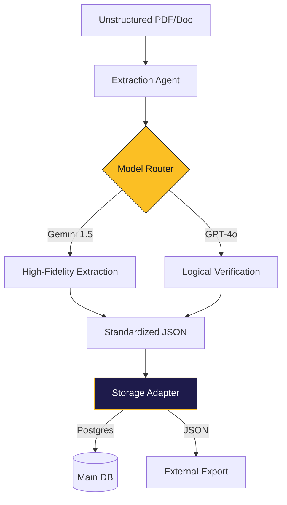

<p align="center">
  
</p>

<p align="center">
  <b>The Modular AI Content Factory for Global Educational Automation</b>
</p>

<p align="center">
  
  
  
  
  
</p>

---

Edmate Lab_QA is a **headless, open-source service platform** designed to transform unstructured educational materials (**PDF, Excel, Docx**) into high-fidelity, curriculum-aligned **Q&A, explanations, and 3D flashcards**.

Built on a "Plug & Play" architecture, it empowers teachers, publishers, and developers to serve external platforms using their own AI logic and API keys.

## ✨ Key Features

- 🛡️ **Economic Kill-Switch**: Real-time token tracking with automatic pipeline halts when daily USD budgets are reached.
- 🧩 **Intelligence-Blind**: LLM-agnostic routing via LiteLLM. Support for 100+ providers (Gemini, OpenAI, Anthropic, etc.).
- 💾 **Adapter-Driven Persistence**: Swap between Postgres, Vector DBs, or JSON exports with zero changes to core logic.
- ⚡ **MCP Ready**: Plug Edmate directly into Agentic IDEs (Cursor/Windsurf) as a native tool for instant content generation.
- 📊 **Automation Hub**: A sleek, dark-mode dashboard for managing drafts, review workflows, and cost analytics.

---

## 🚀 30-Second Quick Start

Get Edmate running in seconds using the CLI orchestrator.

```bash
# 1. Clone & Install
git clone https://github.com/shmukit/Edmate.git
cd Edmate
pip install -r content_gen/requirements.txt

# 2. Configure (Set your keys)
cp content_gen/.env.example content_gen/.env

# 3. Process a PDF
python3 content_gen/scripts/pipeline/pipeline_orchestrator.py --single-pdf path/to/your_paper.pdf
```

---

## 🏗️ Modular Architecture

Edmate is built for extensibility. It uses the **Adapter Pattern** to remain decoupled from specific AI models and database schemas.



---

## 📂 Repository Layout

- `content_gen/core/`: The "Brain"—Routing, Budgeting, and Schema logic.
- `content_gen/adapters/`: The "Connectors"—Postgres and Base storage interfaces.
- `qc_viewer/`: The "Heart"—FastAPI backend and Vanilla JS Automation Hub.
- `docs/`: Deep-dive documentation on system design and database schemas.

---

## 🤝 Community & Contributing

We welcome contributions of all kinds! Whether it's a new Storage Adapter, an extraction prompt, or a bug fix.

- 📖 **[Contributing Guide](CONTRIBUTING.md)**: How to get started.
- 📜 **[Code of Conduct](CODE_OF_CONDUCT.md)**: Our community standards.
- 🏗️ **[Modular Architecture Guide](content_gen/docs/CONTRIBUTING_MODULAR.md)**: Deep dive for developers.

---

## 📄 License
MIT License - Open Source

**Built with ❤️ for an accessible, AI-powered education system.**
