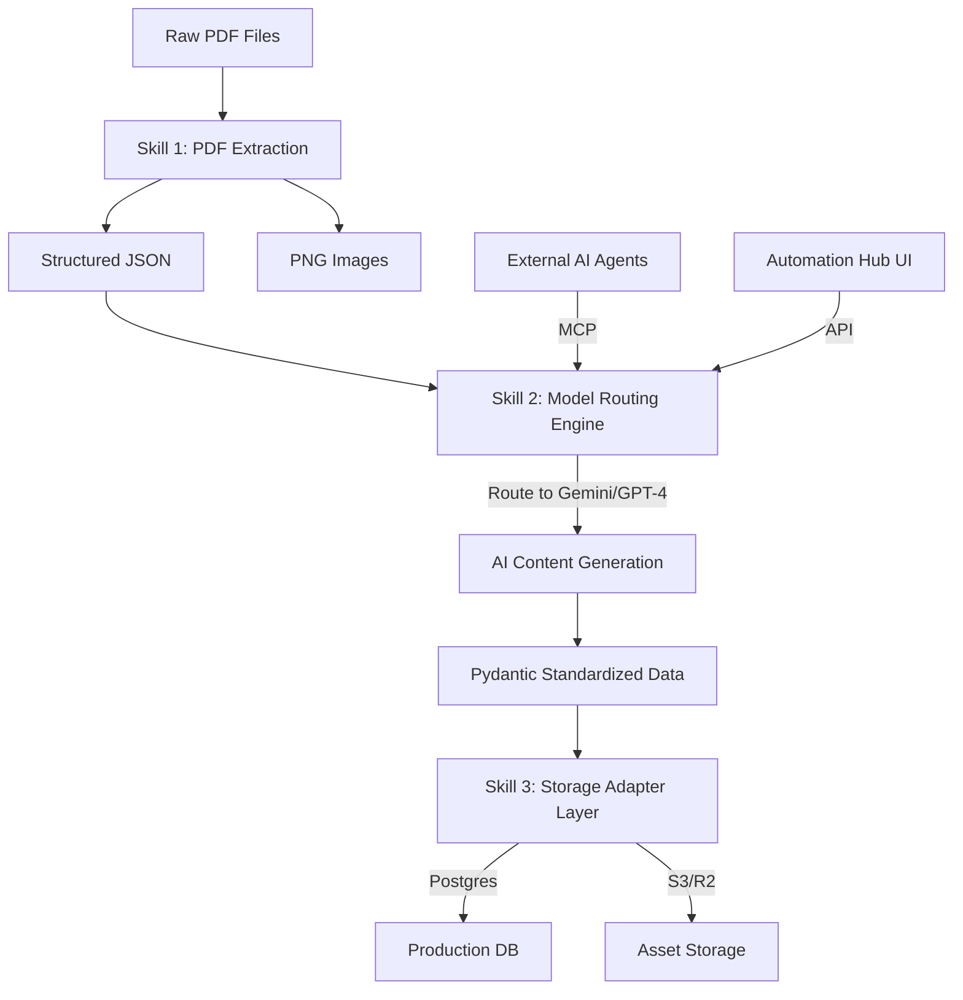

# Edmate Modular Agentic Workflow Architecture

## Executive Summary

This document defines the **modular agentic workflow** for educational content generation at Edmate. The system is designed to be vendor-agnostic and schema-flexible, allowing for automated conversion of raw exam PDFs into structured, pedagogically-rich learning modules.

**Status**: ✅ Fully Automated & Modularized (Adapters + Router + MCP)

---

## System Architecture

---

## 🛠️ Core Components

### 1. Model Routing Engine (`model_router.py`)
Provides a single entry point for all LLM interactions. It uses **LiteLLM** to decouple the pipeline from specific providers.
- **Economic Kill-Switch:** Automatically halts execution if the session cost exceeds the user-defined `max_budget`.
- **Hybrid Metrics:** Tracks cost and token usage in real-time.

### 2. Storage Adapter Layer (`adapters/`)
Implements the **Adapter Pattern** to ensure the pipeline is "Database Blind."
- **BaseStorageAdapter:** The abstract contract for all storage targets.
- **PostgresStorageAdapter:** Maps standardized question data to the legacy Edmate SQL schema.

### 3. Orchestrator (`pipeline_orchestrator.py`)
Coordinates the end-to-end flow:
1. **Extraction:** Invokes `PDFExtractKitWrapper`.
2. **Persistence:** Initializes schema via `StorageAdapter.initialize_schema()`.
3. **Loop:** Iterate through questions, invoking the Router for intelligence and the Adapter for storage.

---

## 🚀 Workflow Phases

### Phase 1: Multimodal Extraction
**Skill**: PDF Question Extraction  
**Tool**: `PDFExtractKitWrapper`
- Parses PDF pages with spatial awareness.
- Extracts vector diagrams with High-DPI rendering (3x).
- Standardizes output into Pydantic-validated JSON.

### Phase 2: Intelligent Generation & Routing
**Skill**: Model Routing Engine  
**Configuration**: `edmate_config.yaml`
- **Dynamic Routing:**
    - `extraction`: Gemini 1.5 Pro (Multimodal)
    - `generation`: Claude 3 Haiku (Fast/Cost-effective)
    - `review`: GPT-4o (High Reasoning)
- **Budget Monitoring:** Session cost is tracked dynamically.

### Phase 3: Modular Persistence
**Skill**: Storage Adapter  
**Adapter**: `PostgresStorageAdapter`
- Atomic inserts for Questions, Flashcards, and Concept Gaps.
- Foreign key management for relational integrity.
- Automatic schema initialization for new environments.

---

## 🤖 Agentic Integration (MCP)

Edmate exposes its core workflow as a **Model Context Protocol (MCP)** server. This allows external AI agents (like Cursor or Windsurf) to use Edmate's intelligence natively.

**Tools Exposed:**
- `generate_edmate_content`: Direct access to the modular generator.
- `get_pipeline_metrics`: Real-time session analytics.

---

## 📂 Repository Layout (Modular)

- `/content_gen/core/`: Intelligence, Metrics, and Configuration.
- `/content_gen/adapters/`: Database and Storage interfaces.
- `/content_gen/scripts/`: Orchestration and processing scripts.
- `/content_gen/mcp_server.py`: MCP entry point.

**Built for scalability, modularity, and open-source contribution.**
