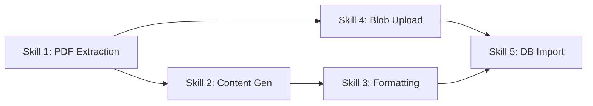

# Skills Catalog: Content Generation System

## Overview

This document provides **formal definitions** for all reusable skills in the Edmate content generation system. Each skill represents a discrete, composable capability that can be invoked independently or as part of a larger workflow.

---

## Skill 1: PDF Question Extraction

### Metadata
- **Skill ID**: `pdf_question_extraction`
- **Status**: ✅ Implemented
- **Scripts**: `smart_extract.py`, `extract_pdf_content.py`
- **Complexity**: High
- **Dependencies**: PyMuPDF (`fitz`), Pillow (`PIL`)

### Purpose
Extract questions, options, and diagrams from A/O-level exam PDFs with spatial awareness and intelligent image clustering.

### Inputs
| Parameter | Type | Required | Description |
|-----------|------|----------|-------------|
| `pdf_path` | String | Yes | Absolute path to PDF file |
| `output_dir` | String | No | Output directory (default: `content_gen/data/extracted`) |

### Outputs
| Output | Type | Description |
|--------|------|-------------|
| JSON file | File | `{base_name}_smart_extracted.json` with structured questions |
| PNG images | Files | High-resolution diagrams in `images/` subdirectory |

### Output Schema
```json
{
  "source": "path/to/pdf",
  "questions": [
    {
      "question_number": 1,
      "page": 1,
      "stem_images": ["q1_stem.png"],
      "option_images": {
        "A": ["q1_opt_A.png"],
        "B": ["q1_opt_B.png"],
        "C": ["q1_opt_C.png"],
        "D": ["q1_opt_D.png"]
      }
    }
  ]
}
```

### Algorithm Details

#### 1. Anchor Detection
**Purpose**: Identify question numbers and option letters

**Constraints**:
- Question numbers: `1-50`, left margin `x < 65`
- Option letters: `A, B, C, D`, left margin `x < 100`
- Sorted by Y-coordinate (top to bottom)

**Code Reference**: [`smart_extract.py:43-78`](file:///Users/mukit_10ms/Documents/GitHub/Edmate/content_gen/scripts/smart_extract.py#L43-L78)

#### 2. Quadrant Logic
**Purpose**: Split multi-option diagrams into A/B/C/D quadrants

**Trigger**: 4+ option anchors detected within image region

**Logic**:
- Calculate midpoint: `mid_x = (min(xs) + max(xs)) / 2`, `mid_y = (min(ys) + max(ys)) / 2`
- Assign paths to quadrants:
  - **A**: `x < mid_x AND y < mid_y` (top-left)
  - **B**: `x >= mid_x AND y < mid_y` (top-right)
  - **C**: `x < mid_x AND y >= mid_y` (bottom-left)
  - **D**: `x >= mid_x AND y >= mid_y` (bottom-right)

**Code Reference**: [`smart_extract.py:154-195`](file:///Users/mukit_10ms/Documents/GitHub/Edmate/content_gen/scripts/smart_extract.py#L154-L195)

#### 3. Proximity Merge
**Purpose**: Combine nearby drawing paths into single images

**Thresholds**:
- Vertical: 45px
- Horizontal: 30px

**Logic**: If `(b[1] - last[3]) < 45 OR (b[0] - last[2]) < 30`, merge bounding boxes

**Code Reference**: [`smart_extract.py:211-220`](file:///Users/mukit_10ms/Documents/GitHub/Edmate/content_gen/scripts/smart_extract.py#L211-L220)

#### 4. Expansion & Padding
**Purpose**: Prevent clipping of bonds, lines, and labels

**Parameters**:
- Search pad: 15px (for expansion detection)
- Final pad: 20px (white border)

**Code Reference**: [`smart_extract.py:233-251`](file:///Users/mukit_10ms/Documents/GitHub/Edmate/content_gen/scripts/smart_extract.py#L233-L251)

### Usage Example
```python
from smart_extract import SmartQuestionExtractor

extractor = SmartQuestionExtractor(
    pdf_path="/path/to/9701_s25_qp_13.pdf",
    output_dir="content_gen/data/extracted"
)
result = extractor.extract()
print(f"Extracted {len(result['questions'])} questions")
```

### Performance
- **Speed**: ~10-20 seconds per PDF (20 pages, 40 questions)
- **Resolution**: 3x scale (high-DPI rendering)
- **Accuracy**: 95%+ question detection, 90%+ diagram extraction

---

## Skill 2: Content Generation (Gemini)

### Metadata
- **Skill ID**: `gemini_content_generation`
- **Status**: ✅ Implemented (Manual Workflow)
- **Implementation**: Prompt-based (Gemini API)
- **Complexity**: Medium
- **Dependencies**: Gemini API access

### Purpose
Generate pedagogically-rich explanations, concept gap analysis, and flashcards for exam questions.

### Inputs
| Parameter | Type | Required | Description |
|-----------|------|----------|-------------|
| `question_text` | String | Yes | Full question text with options |
| `marks_scheme` | String | Yes | Official marks scheme |
| `subject` | String | Yes | "Biology", "Chemistry", or "Physics" |
| `question_range` | String | No | e.g., "1-10" (default: all) |

### Outputs
| Output | Type | Description |
|--------|------|-------------|
| Markdown document | String | Structured explanations with headers |

### Output Structure
```markdown
Question 1

Question and Options in Text Format
[Question text]
A [Option A]
B [Option B]
C [Option C]
D [Option D]

Detailed Explanation
Core Concept: [Biological/Chemical/Physical principle]

Analyze Step 1: [Analysis] → [Intermediate result]
Analyze Step 2: [Analysis] → [Intermediate result]
...

Final Correct Answer: 🅱️

Option Wise Explanation
Option 🅰️ is incorrect because...
Option 🅱️ is correct because...
Option 🅲️ is incorrect because...
Option 🅳️ is incorrect because...

🧠 Concept Gap Analysis and Flashcards

Option 🅰️ Gap: [Misconception or knowledge gap]
Flashcard 1: [Front question]? Back: [Answer].
Flashcard 2: [Front question]? Back: [Answer].

Option 🅲️ Gap: [Misconception or knowledge gap]
Flashcard 1: [Front question]? Back: [Answer].
...
```

### Prompt Template
```text
[Question Paper Name] is the question paper and [Marks Scheme Name] is the answer.

For the provided [Subject] questions [Range], generate detailed analysis using:

1. Question Number
2. Question and Options in Text Format
3. Detailed Explanation:
   - Core Concept
   - Step-by-Step Analysis (Analyze Step 1, 2, 3...)
   - Final Correct Answer
4. Option Wise Explanation (paragraph format)
5. 🧠 Concept Gap Analysis and Flashcards:
   - For each wrong option: identify gap
   - 2-3 tailored flashcards per option
   - Format: "Flashcard X: [Front]? Back: [Back]."

Formatting Rules:
- Use markdown headers (##, ###)
- Paragraph format (no tables)
- Detailed, rigorous explanations
- Adhere to syllabus standards
```

### Usage Example (Manual)
1. Upload question paper + marks scheme to Gemini
2. Paste prompt with subject and range
3. Copy generated markdown output

### Future: API Integration
```python
import google.generativeai as genai

genai.configure(api_key=os.environ["GEMINI_API_KEY"])
model = genai.GenerativeModel("gemini-1.5-pro")

response = model.generate_content([
    prompt_template.format(
        subject="Biology",
        range="1-10"
    ),
    question_paper_file,
    marks_scheme_file
])

content = response.text
```

---

## Skill 3: Content Formatting (Google Docs)

### Metadata
- **Skill ID**: `google_docs_formatting`
- **Status**: ✅ Implemented (Manual Workflow)
- **Implementation**: Prompt-based (ChatGPT)
- **Complexity**: Low
- **Dependencies**: ChatGPT API access

### Purpose
Convert LaTeX and markdown to Google Docs-compatible Unicode format.

### Inputs
| Parameter | Type | Required | Description |
|-----------|------|----------|-------------|
| `raw_content` | String | Yes | Gemini output with LaTeX/markdown |

### Outputs
| Output | Type | Description |
|--------|------|-------------|
| Formatted text | String | Unicode-formatted, Google Docs ready |

### Transformation Rules
| Input | Output | Example |
|-------|--------|---------|
| `$E_a$` | `Eₐ` | Activation energy |
| `$e^{-E_a/RT}$` | `e^(–Eₐ/RT)` | Arrhenius equation |
| `$\frac{3}{2}kT$` | `³⁄₂kT` | Kinetic energy |
| `$\Delta H$` | `ΔH` | Enthalpy change |
| `$\alpha$, `$\beta$` | `α`, `β` | Greek letters |
| `🅰️`, `🅱️`, `🧠` | (preserved) | Emoji |

### Prompt Template
```text
Rewrite the following document for Google Docs compatibility:

- Convert all LaTeX math (like $E_a$, $e^{-E_a/RT}$, $\frac{3}{2}kT$) into readable text form using Unicode subscripts/superscripts (e.g., Eₐ, e^(–Eₐ/RT), ³⁄₂kT).
- Preserve Greek symbols (Δ, α, β) in Unicode.
- Keep all emoji (🅰️, 🅱️, 🧠) and section headers intact.
- Maintain indentation, lists, and step numbering.
- Remove dollar signs or LaTeX markup while keeping equations visually clear.
- Output as plain text for direct pasting into Google Docs without breaking.
- Do not reduce text, keep it as it is.

[PASTE GEMINI OUTPUT HERE]
```

### Usage Example (Manual)
1. Copy Gemini output
2. Paste into ChatGPT with prompt
3. Copy formatted output to Google Docs

### Future: API Integration
```python
import openai

response = openai.ChatCompletion.create(
    model="gpt-4",
    messages=[
        {"role": "system", "content": formatting_prompt},
        {"role": "user", "content": raw_gemini_content}
    ]
)

formatted_content = response.choices[0].message.content
```

---

## Skill 4: Blob Storage Upload

### Metadata
- **Skill ID**: `blob_storage_upload`
- **Status**: ⚠️ Not Implemented
- **Target Script**: `upload_to_storage.py`
- **Complexity**: Medium
- **Dependencies**: `boto3` (S3) or `cloudflare` SDK (R2)

### Purpose
Upload extracted PNG images to cloud storage (R2/S3) and generate CDN URLs.

### Inputs
| Parameter | Type | Required | Description |
|-----------|------|----------|-------------|
| `images_dir` | String | Yes | Directory containing PNG files |
| `storage_provider` | String | Yes | "r2" or "s3" |
| `bucket_name` | String | Yes | Storage bucket name |
| `base_path` | String | No | Path prefix (e.g., "diagrams/9701_s25_qp_13") |

### Outputs
| Output | Type | Description |
|--------|------|-------------|
| CDN URL mapping | Dict | `{filename: cdn_url}` |
| Upload report | Dict | Success count, errors |

### Output Schema
```json
{
  "cdn_mapping": {
    "q1_stem.png": "https://cdn.edmate.com/diagrams/9701_s25_qp_13/q1_stem.png",
    "q1_opt_A.png": "https://cdn.edmate.com/diagrams/9701_s25_qp_13/q1_opt_A.png"
  },
  "report": {
    "total": 50,
    "uploaded": 50,
    "failed": 0,
    "errors": []
  }
}
```

### Implementation Pseudocode
```python
def upload_to_storage(images_dir, provider, bucket, base_path):
    client = get_storage_client(provider)
    cdn_mapping = {}
    
    for image_path in Path(images_dir).glob("*.png"):
        key = f"{base_path}/{image_path.name}"
        
        # Upload with retry
        cdn_url = client.upload_file(
            file_path=str(image_path),
            bucket=bucket,
            key=key,
            acl="public-read"
        )
        
        cdn_mapping[image_path.name] = cdn_url
    
    return cdn_mapping
```

### Storage Provider Configuration

#### Cloudflare R2
```python
import boto3

s3 = boto3.client(
    's3',
    endpoint_url=f'https://{R2_ACCOUNT_ID}.r2.cloudflarestorage.com',
    aws_access_key_id=R2_ACCESS_KEY_ID,
    aws_secret_access_key=R2_SECRET_ACCESS_KEY
)

s3.upload_file(
    Filename=local_path,
    Bucket=R2_BUCKET_NAME,
    Key=key,
    ExtraArgs={'ACL': 'public-read'}
)

cdn_url = f"{R2_PUBLIC_URL}/{key}"
```

#### AWS S3
```python
import boto3

s3 = boto3.client('s3')

s3.upload_file(
    Filename=local_path,
    Bucket=AWS_S3_BUCKET,
    Key=key,
    ExtraArgs={'ACL': 'public-read'}
)

cdn_url = f"https://{AWS_S3_BUCKET}.s3.amazonaws.com/{key}"
```

---

## Skill 5: Database Import

### Metadata
- **Skill ID**: `database_import`
- **Status**: ⚠️ Not Implemented
- **Target Script**: `import_to_db.py`
- **Complexity**: Medium
- **Dependencies**: `psycopg2` or `supabase-py`

### Purpose
Import structured question data, diagrams, and flashcards into PostgreSQL/Supabase.

### Inputs
| Parameter | Type | Required | Description |
|-----------|------|----------|-------------|
| `json_path` | String | Yes | Path to extracted JSON |
| `cdn_mapping` | Dict | Yes | Filename → CDN URL mapping |
| `db_connection` | String | Yes | Database connection string |
| `paper_metadata` | Dict | No | Subject, difficulty, topics |

### Outputs
| Output | Type | Description |
|--------|------|-------------|
| Import report | Dict | Questions inserted, diagrams linked, errors |

### Output Schema
```json
{
  "report": {
    "questions_inserted": 40,
    "diagrams_inserted": 65,
    "flashcards_inserted": 120,
    "errors": []
  }
}
```

### Implementation Pseudocode
```python
def import_to_database(json_path, cdn_mapping, db_connection, metadata):
    conn = psycopg2.connect(db_connection)
    cur = conn.cursor()
    
    with open(json_path) as f:
        data = json.load(f)
    
    for question in data["questions"]:
        # Insert question
        cur.execute("""
            INSERT INTO questions (question_number, paper_code, subject)
            VALUES (%s, %s, %s) RETURNING id
        """, (question["question_number"], metadata["paper_code"], metadata["subject"]))
        
        question_id = cur.fetchone()[0]
        
        # Insert stem diagrams
        for img_filename in question["stem_images"]:
            cdn_url = cdn_mapping.get(Path(img_filename).name)
            if cdn_url:
                cur.execute("""
                    INSERT INTO diagrams (question_id, cdn_url, diagram_type)
                    VALUES (%s, %s, %s)
                """, (question_id, cdn_url, "stem"))
        
        # Insert option diagrams
        for option, img_list in question["option_images"].items():
            for img_filename in img_list:
                cdn_url = cdn_mapping.get(Path(img_filename).name)
                if cdn_url:
                    cur.execute("""
                        INSERT INTO diagrams (question_id, cdn_url, diagram_type)
                        VALUES (%s, %s, %s)
                    """, (question_id, cdn_url, f"option_{option}"))
    
    conn.commit()
    conn.close()
```

---

## Skill Dependencies



---

## Skill Invocation Patterns

### Pattern 1: Full Pipeline (Automated)
```python
# Extract
json_data, images = pdf_extraction(pdf_path)

# Upload
cdn_mapping = blob_upload(images, provider="r2")

# Generate (future: API)
content = gemini_generation(json_data, marks_scheme)

# Format (future: API)
formatted = google_docs_formatting(content)

# Import
db_import(json_data, cdn_mapping, formatted, db_conn)
```

### Pattern 2: Manual Content Generation
```python
# Extract
json_data, images = pdf_extraction(pdf_path)

# Manual: User generates content via Gemini UI
# Manual: User formats via ChatGPT UI

# Upload
cdn_mapping = blob_upload(images, provider="r2")

# Import
db_import(json_data, cdn_mapping, manual_content, db_conn)
```

### Pattern 3: Batch Processing
```python
for pdf_path in glob.glob("content_gen/data/inputs/*.pdf"):
    json_data, images = pdf_extraction(pdf_path)
    cdn_mapping = blob_upload(images, provider="r2")
    db_import(json_data, cdn_mapping, db_conn)
```

---

## Skill 6: LLM-as-Judge Evaluation

### Metadata
- **Skill ID**: `llm_as_judge_eval`
- **Status**: ⚠️ Target (Planned)
- **Implementation**: API-based (GPT-4o/Claude)
- **Complexity**: Medium
- **Dependencies**: LLM API access, `QC_RUBRIC.md`

### Purpose
Automate the quality control of generated educational explanations by using a separate, high-reasoning LLM to score and critique the output.

### Capabilities
- **Pedagogical Audit**: Verifying that the explanation follows the Step-by-Step logic.
- **Accuracy Verification**: Cross-checking the explanation against the provided correct answer.
- **Rubric Scoring**: Generating a 1-10 score based on `QC_RUBRIC.md`.
- **Misconception Detection**: Ensuring option-wise explanations address the specific concept gap.

### Usage Pattern
1. Take generated output from **Skill 2**.
2. Run through Judge LLM with **QC Rubric** as the system prompt.
3. If score < 8, trigger re-generation or flag for human review.

---

## Skill Metrics

| Skill | Avg Time | Success Rate | Error Types |
|-------|----------|--------------|-------------|
| **PDF Extraction** | 10-20s | 95% | Anchor misdetection, diagram clipping |
| **Content Gen** | 30-60s | 98% | API rate limits |
| **Formatting** | 5-10s | 99% | Unicode edge cases |
| **Blob Upload** | 5-10s | 99% | Network errors, auth failures |
| **DB Import** | 2-5s | 99% | Constraint violations, duplicates |

---

## Future Enhancements

### Skill 6: Equation Extraction (LaTeX OCR)
- **Purpose**: Convert equation images to LaTeX strings
- **Tools**: Mathpix API, LaTeX-OCR
- **Status**: Planned

### Skill 7: Table Detection & Parsing
- **Purpose**: Extract tabular data from PDFs
- **Tools**: `pdfplumber`, Camelot
- **Status**: Planned

### Skill 8: AI Alt Text Generation
- **Purpose**: Generate accessibility descriptions for diagrams
- **Tools**: Gemini Vision API
- **Status**: Planned
