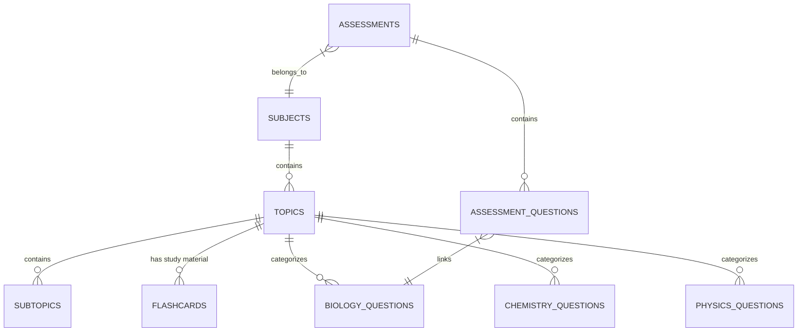

# Edmate Database Schema

This document provides a technical overview of the `mukit_edmate_frontend` PostgreSQL database, detailing the purpose of each table and their relationships.

---

## 1. Core Question Tables

Questions are stored in subject-specific and grade-specific tables. All question tables share a similar structure.

| Table Name | Description |
| :--- | :--- |
| `biology_questions` | A-Level Biology questions. |
| `chemistry_questions` | A-Level Chemistry questions. |
| `physics_questions` | A-Level Physics questions. |
| `igcse_biology_questions` | IGCSE Biology questions. |
| `igcse_chemistry_questions` | IGCSE Chemistry questions. |
| `igcse_physics_questions` | IGCSE Physics questions. |

### Common Question Columns
- **`id`**: UUID (Primary Key).
- **`question_identifier`**: Unique string in format `<paper_code>/Q<n>`.
- **`title`**: The question text (HTML/Markdown).
- **`options`**: Array of strings `[A, B, C, D]`.
- **`correct_options`**: Array of integers (indices of correct answers).
- **`option_explanations`**: Array of strings (explanations for each option).
- **`other_contents`**: Newline-separated list of CDN/Azure URLs for diagrams/images.
- **`topic_id` / `subtopic_id`**: Foreign keys to the taxonomy tables.
- **`is_verified`**: Boolean indicating if QC has passed.

---

## 2. Taxonomy & Content

| Table Name | Purpose | Relationships |
| :--- | :--- | :--- |
| **`subjects`** | High-level subjects (Biology, Chem, etc.) | Parent of Topics. |
| **`topics`** | Subject chapters/topics. | FK `subjectId` → `subjects`. |
| **`subtopics`** | Granular subtopics. | FK `topicId` → `topics`. |
| **`flashcards`** | Study cards (Front/Back text). | FK `topicId`, `subtopicId`. |
| **`syllabus_notes`** | Detailed revision notes per topic. | FK `topicId`, `subtopicId`. |

> [!NOTE]
> **Flashcard Linking**: Flashcards are currently linked to **Topics**, not individual questions. When viewing a question, the system shows flashcards belonging to that question's `topic_id`.

---

## 3. Assessments & User Progress

| Table Name | Purpose | Relationships |
| :--- | :--- | :--- |
| **`assessments`** | Collections of questions for tests. | FK `subjectId`, `topicId`. |
| **`assessment_questions`** | Join table linking questions to assessments. | FK `assessmentId`, `questionId`. |
| **`assessment_attempts`** | Tracks user performance on assessments. | FK `userId`, `assessmentId`. |
| **`users`** | User profiles and authentication. | |
| **`progress`** | Tracks overall user mastery per topic. | FK `userId`, `topicId`. |

---

## 4. Metadata & Utility

| Table Name | Purpose |
| :--- | :--- |
| **`resources`** | Links to external PDFs or supplementary materials. |
| **`flags_report`** | User-submitted reports for errors in questions. |
| **`drafts`** | Temporary storage for in-progress content creation. |
| **`_prisma_migrations`**| Internal table for tracking database schema changes. |

---

## Entity Relationship Overview (High Level)

