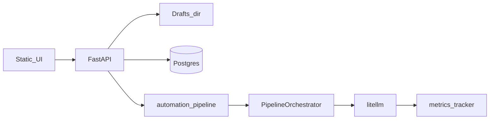

# Edmate architecture (qc_viewer + content_gen)

This document is for operators and developers wiring the QC web app, automation API, and PDF/LLM pipeline.

## High-level data flow

1. **Browser** loads static assets from `qc_viewer/static/` and calls FastAPI routes under `/api/automate`, `/api/v1`, and question endpoints.
2. **Draft upload** (`POST /api/automate/draft`) writes `source.pdf` and `metadata.json` under the configured drafts directory, then schedules **`run_automation_pipeline`** as a FastAPI `BackgroundTasks` job (same process as the web worker).
3. **Pipeline** (`qc_viewer/services/automation_pipeline.py`) builds a **`ModelRoutingEngine`** (`content_gen/core/model_router.py`), runs **`PipelineOrchestrator`** (`content_gen/scripts/pipeline/pipeline_orchestrator.py`) for extraction + generation, normalizes rows via **`build_legacy_question_dict`**, and writes results back into **`metadata.json`**.
4. **LLM calls** go through **LiteLLM** (`litellm.completion`). Usage/cost aggregates are recorded by **`create_metrics_tracker()`** (`content_gen/core/metrics.py`).
5. **Publish** (`POST /api/automate/publish`) validates `table_name` against the workspace allowlist (`qc_viewer/config.py`), then uses **`DatabaseService`** (`content_gen/scripts/processing/database_service.py`) to insert into Postgres.
6. **Prompts** for generation live in **`content_gen/scripts/prompts.py`**. The constant **`CONTENT_GENERATION_PROMPT_VERSION`** is copied into draft **`metadata.json`** and pipeline telemetry for reproducibility.

## Single-process and scaling caveats

- **Background tasks** run **in-process**. Multiple Uvicorn/Gunicorn workers each have their own background queue; a draft started on worker A is not visible to worker B’s memory. Prefer **one worker** for predictable automation, or front the API with sticky sessions, or move long jobs to an **external queue** (RQ/Celery/SQS — not bundled here).
- **Metrics**: `EDMATE_METRICS_BACKEND=file` writes JSON under `content_gen/data/` (or `EDMATE_METRICS_FILE`). Multiple workers **corrupt or skew** that file. Use **`memory`** per process (no cross-worker budget) or **`redis`** with `EDMATE_METRICS_REDIS_URL` for shared aggregates.
- **Rate limit** (`EDMATE_RATE_LIMIT_PER_MINUTE`) is **in-process per server IP**; it is not a global cluster limit.
- **Draft storage** and optional **SQLite job store** (if used) are **local disk** unless you configure shared storage / DB.

## Where to change things

| Concern | Primary location |
|--------|-------------------|
| HTTP automation routes | `qc_viewer/routers/automation.py` |
| Optional API key + rate limit | `qc_viewer/middleware/security.py` (env below) |
| Pipeline steps / orchestration | `content_gen/scripts/pipeline/pipeline_orchestrator.py` |
| Model routing, budget kill-switch | `content_gen/core/model_router.py` |
| System prompts + `prompt_version` | `content_gen/scripts/prompts.py` |
| Postgres insert shapes (publish/import) | `content_gen/scripts/processing/database_service.py`, adapters under `content_gen/adapters/` |
| Allowed tables for QC / publish | `qc_viewer/config.py` (`get_allowed_table_ids`, `is_publish_table_allowed`) |

## Deploy environment variables (security & ops)

| Variable | Purpose |
|----------|---------|
| `EDMATE_REQUIRE_API_KEY` | If truthy (`1`, `true`, …), require `EDMATE_API_KEY` on `/api/automate/*` and `/api/v1/*`. |
| `EDMATE_API_KEY` | Shared secret; client sends `X-API-Key` or `Authorization: Bearer <token>`. |
| `EDMATE_RATE_LIMIT_PER_MINUTE` | Integer cap per client IP per rolling minute (`0` = off). Returns **429** when exceeded. |
| `EDMATE_METRICS_BACKEND` | `file` (default), `memory`, or `redis`. |
| `EDMATE_METRICS_FILE` | Override path when backend is `file`. |
| `EDMATE_METRICS_REDIS_URL` | Redis URL when backend is `redis` (requires `redis` package). |

**Internal lab**: leave API key off, single worker, `file` metrics. **Shared or public network**: set `EDMATE_REQUIRE_API_KEY`, tighten CORS in `qc_viewer/app_factory.py`, use `redis` metrics if multiple workers, and plan an external worker queue for LLM-heavy load.

## Related doc

- Deeper technical notes: `docs/technical/ARCHITECTURE.md` (if present in your tree).
