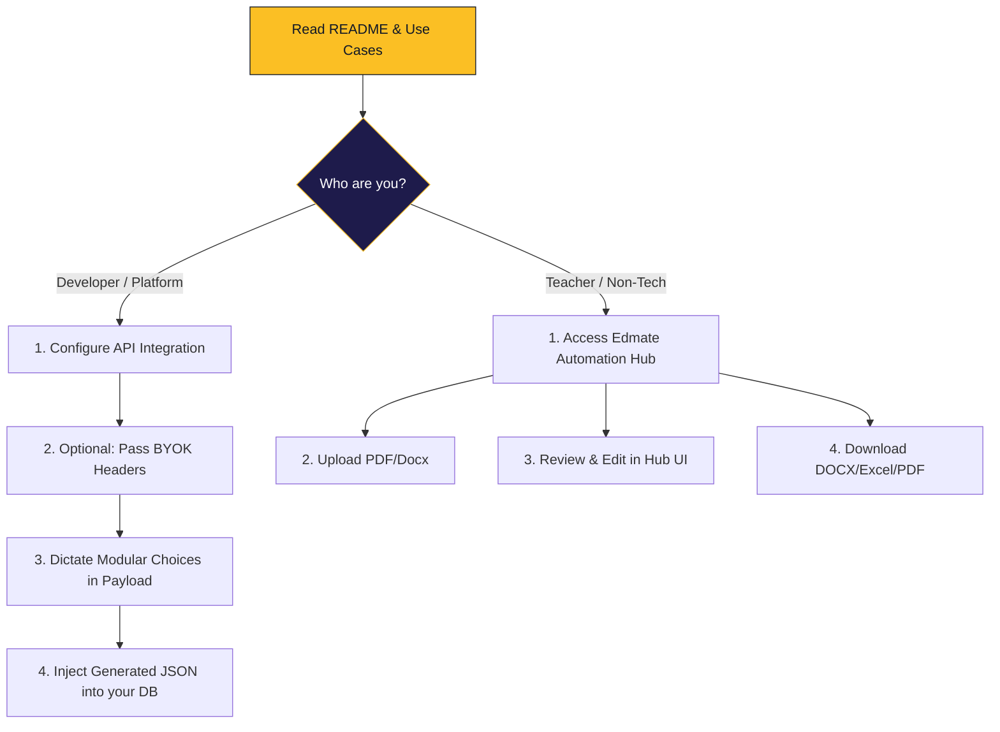

# 🎯 Edmate Use Cases, Scope & Acceptance Criteria

This document defines the operational boundaries of **Edmate**, outlining exactly what the system is built to do, what it explicitly avoids, and the criteria for success in various deployment scenarios.

---

## 🗺️ User Journey: How to Adopt Edmate

The journey from discovery to generation follows a clean, branching path depending on the user's technical profile.

---

## 🔍 Project Scope

Edmate is a **Content Factory Infrastructure**. Its boundaries are strictly defined to ensure high-fidelity assessment generation without feature creep into LMS/SIS territories.

### ✅ In-Scope (Generation Workflow)
*   **Ingestion**: Uploading and parsing unstructured source files (PDF, Excel, Docx).
*   **Generation**: AI-powered creation of high-integrity question, answer, and explanation drafts.
*   **Curation**: A robust UI for reviewing, editing, and manually refining generated content.
*   **Persistence**: Secure injection into institutional question banks or export to portable file formats.
*   **Integrity**: Implementation of HIA (High-Integrity Assessment) logic to resist AI cheating.

### ❌ Out-of-Scope (Learner/Runtime Experience)
*   **Delivery**: Learners taking assessments or tests (this is the platform's job).
*   **Interaction**: Live answer checking or timer-based assessment interfaces.
*   **Analytics**: Grading, result storage, progress tracking, or student performance heatmaps.
*   **Security**: Online proctoring, lockdown browsers, or student identity verification.

---

## 🛠️ User Acceptance Criteria (UAC)

The following criteria must be met to validate the integrity of the automation pipeline.

### Core Generation Flows

| ID | Case | Success Criteria |
| :--- | :--- | :--- |
| **UAC-1** | **Platform Injection** | API accepts source + metadata; returns schema-valid JSON for direct DB insertion. |
| **UAC-2** | **Refinement Loop** | Reviewer can provide specific natural language feedback (e.g., "make it harder") and trigger a precise regeneration. |
| **UAC-3** | **Budget Guardrail** | System stops execution and triggers a `402 Payment Required` or notification when the daily USD token budget is reached. |
| **UAC-4** | **LaTeX Fidelity** | Mathematical formulas and scientific notations are preserved in standard LaTeX syntax across extraction and export. |
| **UAC-5** | **Batch Processing** | System handles concurrent uploads of multiple PDF chapters without cross-talk or data corruption. |
| **UAC-6** | **Standalone Export** | Teacher can download the final reviewed set as a formatted DOCX or Excel file without an external database. |

### ⚠️ Edge Case Handling

| Scenario | Expected Behavior |
| :--- | :--- |
| **Corrupt/Empty PDF** | System returns an explicit `INVALID_SOURCE` error rather than timing out. |
| **Low-OCR Quality** | Questions generated from low-confidence text are flagged in the UI for mandatory manual review. |
| **Prompt Injection** | Source materials containing "Ignore previous instructions" are treated as raw text; the extraction logic remains unaffected. |
| **Duplicate Content** | System identifies and flags identical questions within the same source document to prevent redundant bank entries. |
| **Interrupted Stream** | If the LLM connection drops mid-generation, the system caches the partial draft for resumption rather than full restart. |

---

## 🏢 Segmentation & Workflow Adoption

### Case A: Platform-Integrated Mode (Headless)
**Target**: Organizations with an existing product (e.g., Alopoth) where data and roles stay centralized.
- **Interaction**: Platform backend orchestrates Edmate APIs; content is injected directly into platform tables on approval.

### Case B: Standalone Teacher Mode (UI-first)
**Target**: Individual teachers or small coaching centers with no existing platform.
- **Interaction**: Users use the Edmate Automation Hub for the full upload-review-export lifecycle.

---

## 🛠️ Tenant-level Customization (BYOK & Configuration)

External platforms integrating with Edmate as a service are not locked into the host's defaults. The API supports a **"Bring Your Own Logic"** model through payload-level overrides.

### 🔑 Bring Your Own Key (BYOK)
To ensure cost portability and privacy, platforms can pass their own credentials in the request headers:
- `X-LLM-Provider`: Overrides the default provider (e.g., `anthropic`, `openai`).
- `X-API-Key`: Uses the platform's own billing/quota for the generation task.
- `X-Model-ID`: Specifically dictates the model version (e.g., `gpt-4o-2024-05-13`).

### 🧩 Modular Choice Overrides
The generation payload allows the caller to dictate the "Rules of Engagement":
- **Curriculum Board**: Set `curriculum` to any supported standard (e.g., `IB`, `Cambridge`, `National`).
- **Pedagogical Profile**: Choose a `ls_profile` (`default`, `exam_prep`, `beginner`, `flashcard_only`).
- **Integrity Target**: Set `hia_mode` (`Low`, `Medium`, `High`, `Very High`).
- **Extraction Guardrails**: Set `question_detection_mode`, `min_question_number`, and `max_question_number`.
- **Output Preferences**: Specify the target `output_format` (e.g., `JSON-API`, `Print-Ready-PDF`).

### 🔒 Privacy & Isolation
- **Stateless Generation**: By using BYOK, Edmate acts as a pure processing engine. It does not store the platform's keys; they are passed through to LiteLLM for the duration of the request.
- **Tenant Isolation**: Settings are applied per-request, meaning Platform A can use GPT-4o for SAT content while Platform B uses Gemini 1.5 for National Curriculum on the same Edmate instance.

---

## 🔌 Interaction Models & Packaging

*   **API-first**: System-to-system orchestration for product teams.
*   **UI-first**: Upload, review, and export workflow in a self-serve interface.
*   **Bank-ingestion Package**: Structured question payload (`question`, `options`, `explanation`, `hia_details`).
*   **Export Package**: Downloadable files (DOC/PDF/Excel) with source attribution and generation timestamps.
