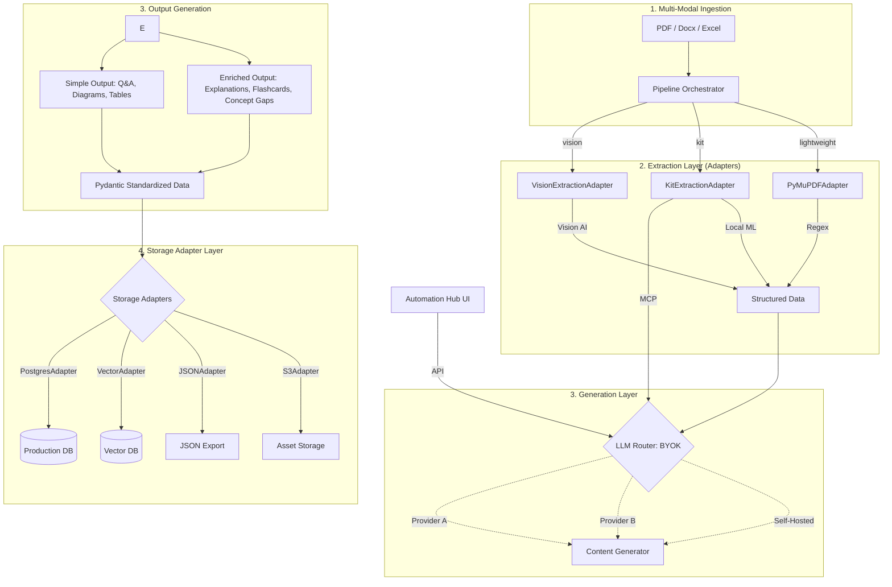

# Edmate Modular Agentic Workflow Architecture

## Executive Summary

This document defines the **modular agentic workflow** for educational content generation at Edmate. The system is designed to be vendor-agnostic and schema-flexible, allowing for automated conversion of raw exam PDFs into structured, pedagogically-rich learning modules.

**Status**: ✅ Fully Automated & Modularized (Adapters + Router + MCP)

---

## System Architecture

---

## 🛠️ Core Components

### 1. Model Routing Engine (`model_router.py`)
Provides a single entry point for all LLM interactions. It uses **LiteLLM** to decouple the pipeline from specific providers.
- **Economic Kill-Switch:** Automatically halts execution if the session cost exceeds the user-defined `max_budget`.
- **Hybrid Metrics:** Tracks cost and token usage in real-time.

### 2. Extraction Adapters (`adapters/`)
Implements the **Adapter Pattern** for multi-engine PDF parsing.
- **VisionExtractionAdapter:** Uses multimodal LLMs (Gemini/GPT-4o) to "see" the document layout and extract diagrams with spatial awareness.
- **KitExtractionAdapter:** Leverages local ML (YOLO) for layout detection.
- **PyMuPDFAdapter:** Lightweight, regex-based text extraction.

### 3. Storage Adapter Layer (`adapters/`)
Ensures the pipeline is "Database Blind."
- **BaseStorageAdapter:** The abstract contract for all storage targets.
- **PostgresStorageAdapter:** Maps standardized question data to the legacy Edmate SQL schema.

### 4. Orchestrator (`pipeline_orchestrator.py`)
Coordinates the end-to-end flow:
1. **Extraction:** Invokes the configured `ExtractionAdapter` (Vision, Kit, or Lightweight).
2. **Persistence:** Initializes schema via `StorageAdapter.initialize_schema()`.
3. **Loop:** Iterate through extracted questions, invoking the `ContentGenerator` for enrichment and the `StorageAdapter` for persistence.

---

## 🚀 Workflow Phases

### Phase 1: Multimodal Extraction
**Skill**: Multi-Format Ingestion  
**Tool**: `Modality Extractor`
- Parses diverse unstructured inputs: **PDFs, Docx, and Excel/CSV**.
- Decouples modalities: extracts and handles **Text, Tables, and Images/Diagrams** independently with spatial awareness.
- Extracts vector diagrams with High-DPI rendering.

### Phase 2: Intelligent Generation & Routing
**Skill**: Pedagogy & Model Routing Engine  
**Configuration**: `edmate_config.yaml`
- **Pedagogy & Curriculum Injection:** Dynamically applies Learning Science principles (e.g., HIA for AI Critiques, Isomorphic Variants) based on the selected curriculum format (GCSE, National, Custom).
- **Dynamic Routing (BYOK):**
    - `extraction`: Any Multimodal Provider
    - `generation`: Any High-Reasoning Provider
    - `open_source`: Local/Self-hosted weights
- **Multi-Tier Output:** Generates simple text/images alongside enriched data (explanations, flashcards, concept gaps).
- **Budget Monitoring:** Session cost is tracked dynamically.

### Phase 3: Modular Persistence
**Skill**: Storage Adapter  
**Adapter**: `PostgresStorageAdapter`
- Atomic inserts for Questions, Flashcards, and Concept Gaps.
- Foreign key management for relational integrity.
- Automatic schema initialization for new environments.

---

## 🤖 Agentic Integration (MCP)

Edmate exposes its core workflow as a **Model Context Protocol (MCP)** server. This allows external AI agents (like Cursor or Windsurf) to use Edmate's intelligence natively.

**Tools Exposed:**
- `generate_edmate_content`: Direct access to the modular generator.
- `get_pipeline_metrics`: Real-time session analytics.

---

## 📂 Repository Layout (Modular)

- `/content_gen/core/`: Intelligence, Metrics, and Configuration.
- `/content_gen/adapters/`: Database and Storage interfaces.
- `/content_gen/scripts/`: Orchestration and processing scripts.
- `/content_gen/mcp_server.py`: MCP entry point.

**Built for scalability, modularity, and open-source contribution.**
