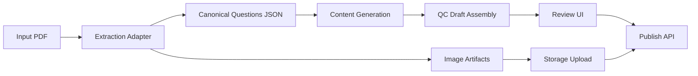

# Pipeline Forensics Playbook

## Purpose

Single source of truth for debugging extraction-to-publish quality regressions in the modular Edmate pipeline.

## End-to-End Flow

## Node Contracts

### Node 1: Extraction Adapter
- **Owner**: `content_gen/adapters/kit_extraction_adapter.py`, `content_gen/scripts/extraction/pdf_extract_kit_wrapper.py`
- **Input contract**: valid PDF path, writable output directory, initialized extraction engine.
- **Output contract**:
  - canonical question list at `result["questions"]` (merged, de-duplicated)
  - raw fragments at `result["raw_questions"]` (debug only)
  - `metadata.stem_images` as file paths, `metadata.stem_images_b64` optional for UI.
- **Validation checks**:
  - no duplicate `question_number`
  - no preamble text assigned above first question marker
  - options dictionary includes `A/B/C/D` keys
  - resolved extraction guardrails recorded (`min_question_number`, `max_question_number`, `question_detection_mode`)
- **Failure symptoms**:
  - intro text leaking into question 1
  - duplicate question numbers
  - missing or clipped diagram/table assets
- **First checkpoints**:
  - inspect extracted JSON under draft or `content_gen/data/extracted`
  - verify `questions` vs `raw_questions` counts and numbering
  - verify active guardrails in draft metadata (`resolved_extraction_settings`) and extraction output (`extraction_settings`)

### Node 2: Image Cropping + Artifact Routing
- **Owner**: `content_gen/scripts/extraction/pdf_extract_kit_wrapper.py`, `content_gen/scripts/pipeline/pipeline_orchestrator.py`
- **Input contract**: detector bboxes and resolved output `images/<paper>/...` directory.
- **Output contract**: PNG files saved with stable names and discoverable via recursive scan.
- **Validation checks**:
  - cropped artifacts include full labels/axes/borders
  - uploader sees same image count as local extracted directory
- **Failure symptoms**:
  - diagram arms or labels cut off
  - images generated locally but not uploaded/mapped
- **First checkpoints**:
  - compare extracted image folder count against upload count
  - open 3-5 known problematic crops manually

### Node 3: Generation Contract
- **Owner**: `content_gen/scripts/processing/content_generator.py`, `content_gen/scripts/prompts.py`
- **Input contract**: canonical question text/options plus strict system prompt markers.
- **Output contract**:
  - `[DE_START]...[DE_END]`
  - `[OE_START]...[OE_END]`
  - `[GA_START]...[GA_END]`
  - flashcards parse into structured pairs
- **Validation checks**:
  - each generated question has DE/OE/GA content
  - flashcards have non-empty `front_text` and `back_text`
- **Failure symptoms**:
  - malformed section boundaries
  - flashcards like `"- **Option B"` appearing as question fields
- **First checkpoints**:
  - inspect `content_gen/logs/all_llm_responses.log`
  - spot-check parsed `ProcessedQuestion` fields

### Node 4: QC Draft Assembly
- **Owner**: `qc_viewer/main.py`
- **Input contract**: generated `ProcessedQuestion` list with explanations, option-wise text, metadata.
- **Output contract** (`metadata.json`):
  - accurate `correct_answer`
  - `generated_content.core_concept`, `detailed_explanation`, `option_analysis`, `flashcards`
  - optional `diagram_base64`
- **Validation checks**:
  - `correct_answer` is not always `N/A`
  - option analysis not empty for MCQs
- **Failure symptoms**:
  - swapped/blank explanation fields
  - empty option analysis
- **First checkpoints**:
  - inspect draft `metadata.json` and `source_extracted.json`

### Node 5: Review + Publish Mapping
- **Owner**: `qc_viewer/static/js/controllers/review.js`
- **Input contract**: draft payload with `correct_answer` letter and option analysis map.
- **Output contract**: publish payload with valid `correct_options` index and option explanations.
- **Validation checks**:
  - answer letter maps to index `A->0`, `B->1`, `C->2`, `D->3`
  - no hardcoded default answer in publish payload
- **Failure symptoms**:
  - all injected questions default to option A
- **First checkpoints**:
  - inspect publish payload in browser network tab

## Rapid Triage Matrix

- **Symptom: Intro section appears inside Q1**
  - likely node: Extraction assignment
  - check: `_assign_to_question` behavior for y above first question
  - fix direction: keep preamble unassigned

- **Symptom: Duplicate numbering or ghost question (e.g. second Q2)**
  - likely node: question detection / dedupe
  - check: extracted canonical vs raw question counts
  - fix direction: tighten detection guardrails and dedupe

- **Symptom: Diagram/table crop cuts text or borders**
  - likely node: bbox crop padding
  - check: sample crops near borders/labels
  - fix direction: adaptive padding

- **Symptom: Generated sections look unstructured**
  - likely node: generation system prompt contract
  - check: response markers in LLM logs
  - fix direction: enforce strict system prompt markers

- **Symptom: Flashcards malformed**
  - likely node: flashcard parser
  - check: GA raw text and parser output
  - fix direction: regex-based extraction, not naive split

- **Symptom: Published answers all A**
  - likely node: review publish mapping
  - check: `correct_options` in publish payload
  - fix direction: derive index from `correct_answer` letter

## Investigation Checklist (10-15 minutes)

1. Inspect draft `source_extracted.json` for numbering, question text quality, options completeness.
2. Confirm active extraction guardrails from draft metadata before debugging quality.
2. Compare local image artifacts and uploaded/mapped image counts.
3. Inspect LLM response logs for DE/OE/GA markers.
4. Inspect draft `metadata.json` for content field mapping and answer extraction.
5. Verify publish payload uses dynamic `correct_options`.
