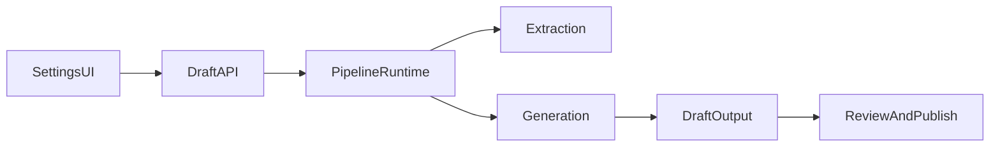

# Pipeline Settings: What Actually Changes Output

This page is the source of truth for which settings in the Automation Hub are currently wired to runtime behavior.

## End-to-end settings flow

## Effective settings (active today)

| UI Label | Transport | Runtime Consumer | Observable Effect |
| --- | --- | --- | --- |
| Curriculum | multipart form `curriculum` | `PedagogyEngine` + draft metadata | Changes curriculum context in generated pedagogy profile metadata. |
| Learning Science Profile | multipart form `ls_profile` | `PedagogyEngine` + draft metadata | Changes Bloom/retrieval/cognitive-load profile used for prompt composition. |
| HIA Resilience Target | multipart form `hia_mode` | `PedagogyEngine` + draft metadata | Changes HIA guidance intensity (Low/Medium/High/Very High). |
| Detection Mode | multipart form `question_detection_mode` | router extraction config | Alters question-number detection strictness in extraction. |
| Minimum Question Number | multipart form `min_question_number` | router extraction config | Filters out questions below threshold. |
| Maximum Question Number | multipart form `max_question_number` | router extraction config | Filters out questions above threshold. |
| API Key (BYOK) | header `X-API-Key` | LiteLLM auth env for request | Uses caller key for LLM billing/quota during the run. |
| BYOK Provider | header `X-LLM-Provider` | runtime model override resolver | Changes provider-family model defaults if model id not supplied. |
| BYOK Model ID | header `X-Model-ID` | runtime model override resolver | Forces explicit model for extraction/generation/validation. |
| Target Table (Injection) | review publish payload `table_name` | publish API / DB service | Changes publish destination table only (not extraction/generation). |

## Display-only or pending settings

| UI Label | Current State | Notes |
| --- | --- | --- |
| Routing Profile | Not wired | Currently a UX placeholder for future policy bundles (cost/quality presets). |
| Target Language | Not wired | Currently shown in UI only; output language control not yet enforced in runtime prompts. |

## API contract used by local UI

### Form fields (`POST /api/automate/draft`)
- `subject`
- `paper_code`
- `file`
- `curriculum`
- `ls_profile`
- `hia_mode`
- `question_detection_mode` (optional)
- `min_question_number` (optional)
- `max_question_number` (optional)

### Optional headers
- `X-API-Key`
- `X-LLM-Provider`
- `X-Model-ID`

## Defaults and fallback behavior

- If extraction guardrail overrides are omitted, defaults come from `edmate_config.yaml` (`extraction_settings` block).
- If `X-LLM-Provider` is omitted, runtime uses config-routed models.
- If `X-LLM-Provider` is provided and `X-Model-ID` is omitted, provider-family defaults are applied.
- If `X-Model-ID` is provided, it has highest precedence for all task types in the request.
